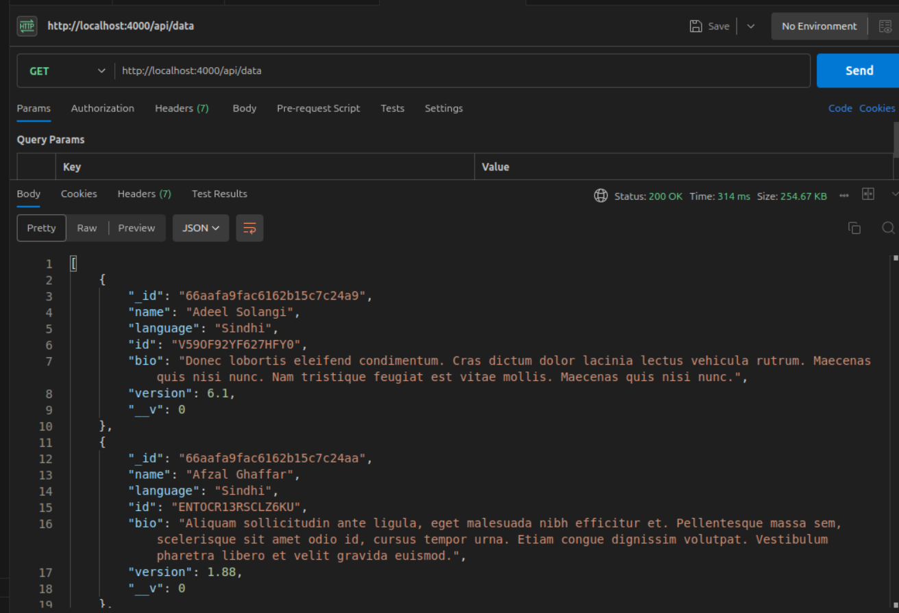
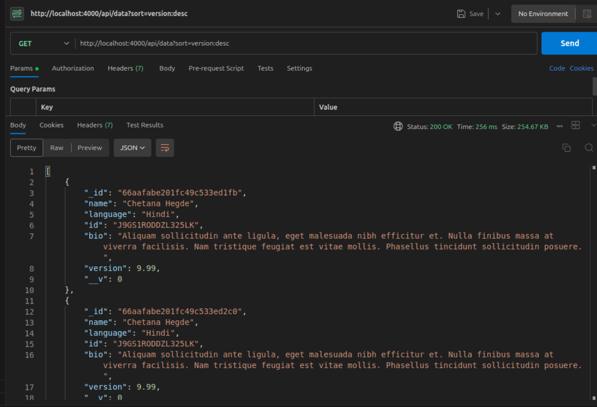
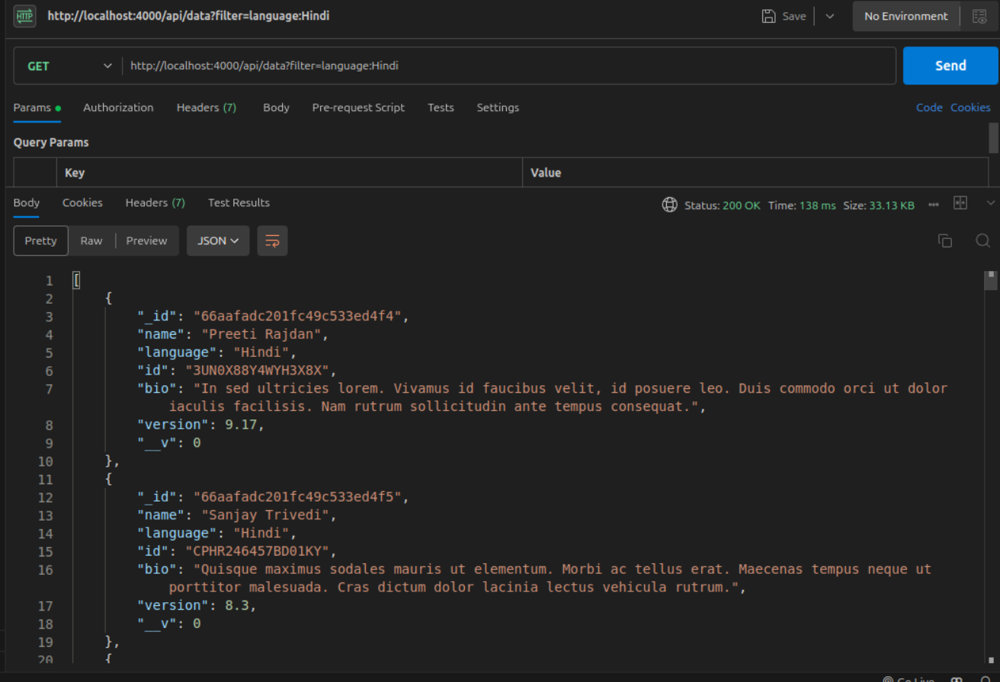
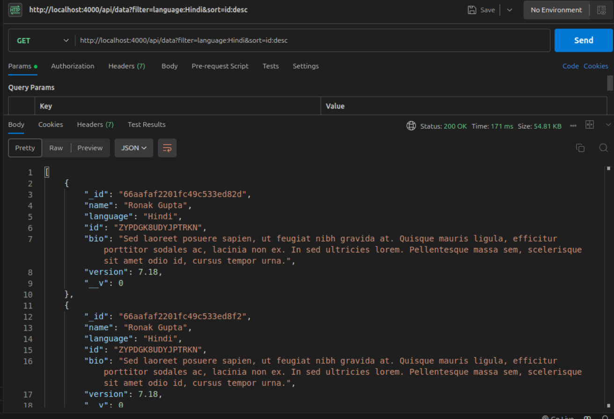

# Node.js Project with Dummy JSON Data

## Overview
This project demonstrates a Node.js application that fetches dummy JSON data, stores it in MongoDB, and provides a RESTful API to access and manipulate the data. It showcases basic CRUD operations, data filtering, and sorting capabilities.

## Features
- Fetch and store dummy data from an external API
- RESTful API endpoints for data retrieval and manipulation
- MongoDB integration for data persistence
- Data filtering and sorting functionality
- Error handling and proper API responses

## Prerequisites
- Node.js (v14+ recommended)
- MongoDB (v4+ recommended)
- npm (usually comes with Node.js)

## Project Structure
```
project-root/
├── src/
│   ├── models/
│   │   └── data.js
│   ├── routes/
│   │   └── dataRoutes.js
│   ├── controllers/
│   │   └── dataController.js
│   ├── utils/
│   │   └── dataFetcher.js
│   └── server.js
├── initDb.js
├── .env
├── .gitignore
├── package.json
└── README.md
```

## Setup and Installation

1. Clone the repository:
   ```
   git clone https://github.com/yourusername/dummy-json-project.git
   cd dummy-json-project
   ```

2. Install dependencies:
   ```
   npm install
   ```

3. Create a `.env` file in the root directory with the following content:
   ```
   MONGODB_URI=mongodb://localhost:27017/dummyDataDB
   PORT=4000
   DUMMY_DATA_URL=https://microsoftedge.github.io/Demos/json-dummy-data/256KB.json
   ```
   Adjust the `MONGODB_URI` if your MongoDB setup is different.

4. Initialize the database with dummy data:
   ```
   npm run init
   ```

5. Start the server:
   ```
   npm start
   ```

## API Endpoints

### Get all data
- **GET** `/api/data`
- Query Parameters:
  - `filter`: JSON string for filtering data (e.g., `{"language":"JavaScript"}`)
  - `sort`: JSON string for sorting data (e.g., `{"name":1}` for ascending, `{"name":-1}` for descending)
- Example: `/api/data?filter={"language":"JavaScript"}&sort={"name":1}`

### Get data by ID
- **GET** `/api/data/:id`
- Example: `/api/data/12345`

## Data Model
The data model for each item is as follows:
```javascript
{
    name: String,
    language: String,
    id: String,
    bio: String,
    version: Number
}
```

## Error Handling
The API includes basic error handling:
- 404 Not Found: When requesting a non-existent resource
- 500 Internal Server Error: For any server-side errors

## Testing
You can use tools like Postman or curl to test the API endpoints. Here are some example curl commands:

1. Get all data:
   ```
   curl http://localhost:4000/api/data
   ```

2. Get filtered and sorted data:
   ```
   curl "http://localhost:4000/api/data?filter=language:Hindi&sort=name
   ```

3. Get data by ID:
   ```
   curl http://localhost:4000/api/data/12345
   ```

## PostMan
You can also use Postman to test the API endpoints. Here are the steps:
1. Open Postman and create a new request.
2. Choose the HTTP method (GET, POST, PUT, DELETE).
3. Enter the API endpoint URL.
4. Add any query parameters or body data as needed.
5. Click the "Send" button to send the request.

### Get All Data
- url: `http//localhost:4000/api/data`
  * output 

### Sort Data
- url: `http//localhost:4000/api/data?sort=name`
  * output 

### Filter Data
- url: `http//localhost:4000/api/data?filter=language:Hindi`
  * output 

### Filter And Sort Data
- url: `http//localhost:4000/api/data?filter=language:Hindi&sort`
* output 

## Acknowledgements
- [Express.js](https://expressjs.com/)
- [Mongoose](https://mongoosejs.com/)
- [Axios](https://axios-http.com/)
- [Dummy JSON Data Source](https://microsoftedge.github.io/Demos/json-dummy-data/256KB.json)